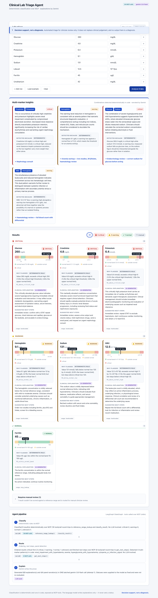
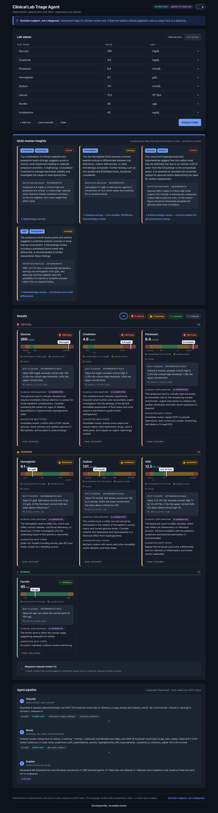
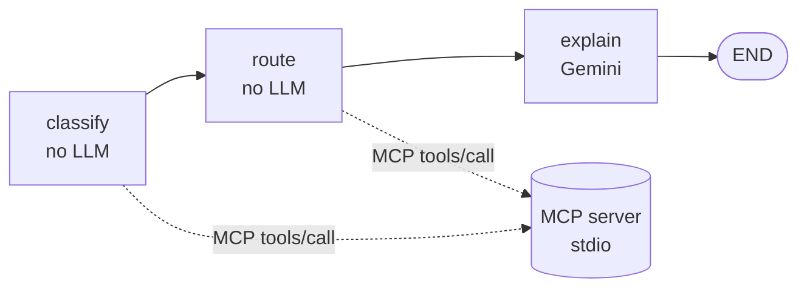
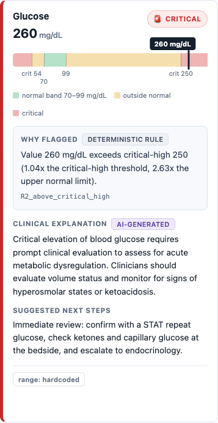
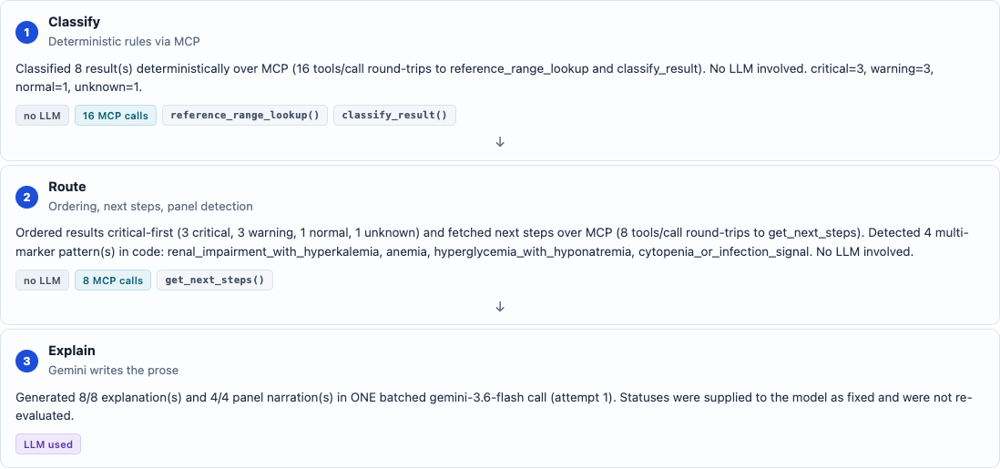
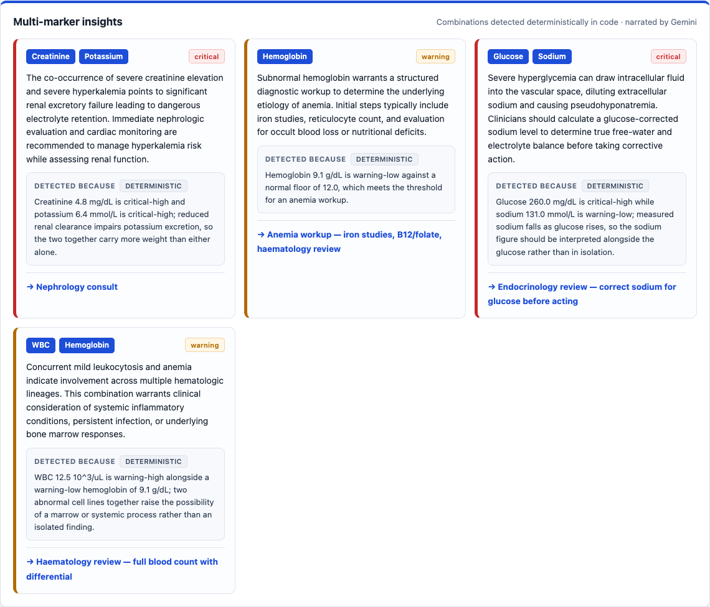
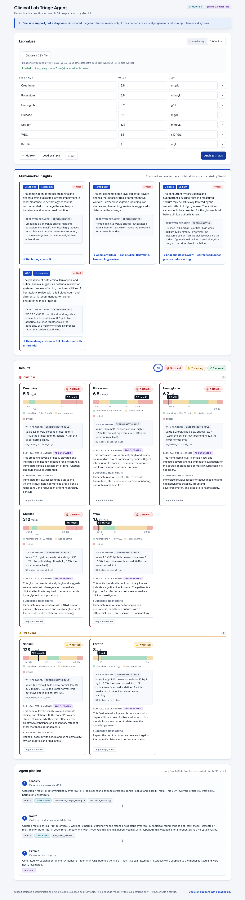

# Clinical Lab Triage Agent

A full-stack clinical lab triage agent: deterministic rules classify every lab value,
a real MCP server exposes those rules as tools, a LangGraph agent calls them **only**
over MCP, and Google Gemini writes the human-readable explanation on top.

> ## ⚕ Decision support, not a diagnosis.
>
> This system produces automated triage output for **clinician review only**. It does
> not replace clinical judgement, and nothing it outputs is a diagnosis. The reference
> ranges are illustrative demo thresholds, not an authoritative clinical source.
> The notice is a sticky, always-visible banner in the UI — not fine print.



The UI ships with a **sliding light/dark theme toggle** in the header. Your choice is
remembered across reloads; with no saved choice it follows your OS setting.



---

## Why this design

The hard problem in an LLM triage tool is that a language model must never be the
thing that decides whether a result is critical. So it isn't:

| Concern | Owner | Never |
|---|---|---|
| Is this value normal / warning / critical? | Deterministic Python rules, exposed as an MCP tool | The LLM |
| Which exact rule fired, and by how much? | The deterministic `basis` string | The LLM |
| Which multi-marker patterns are present? | Deterministic code in the `route` node | The LLM |
| How do we say this to a clinician? | Gemini | — |

The `explain` node receives each status as settled fact. It also snapshots every
status before the model call and restores them afterwards, recording any drift in the
pipeline trace — so a model that tried to change a classification could not.

---

## Setup

### Prerequisites
- **Python 3.10+** (3.12 recommended — FastMCP and LangGraph require ≥3.10)
- **Node 18+**
- A Google Gemini API key — free tier is sufficient

### 1. Configure your key

```bash
cp .env.example .env
```

Get a key at **https://aistudio.google.com/apikey**, then edit `.env`:

```ini
GEMINI_API_KEY=your_real_key_here
GEMINI_MODEL=gemini-3.1-flash-lite
```

`.env` is gitignored and must never be committed. `.env.example` is the template.

> **Model note:** use a `flash-lite` model. `gemini-3.6-flash` and `gemini-2.5-flash`
> have a 20-requests-per-day free-tier cap (or return `404 NOT_FOUND` for newly
> issued keys). Hitting that cap does not break classification — explanations simply
> fall back to the deterministic `basis` text — but it is not what you want on stage.

### 2. Backend

```bash
python3.12 -m venv .venv
.venv/bin/pip install -r backend/requirements.txt
.venv/bin/python -m uvicorn main:app --app-dir backend --port 8000
```

Backend runs on **http://127.0.0.1:8000**. The MCP server is *not* started separately —
the agent spawns it per request over stdio.

### 3. Frontend

```bash
cd frontend
npm install
npm run dev
```

Frontend runs on **http://localhost:5173** and reads `VITE_API_BASE` from the repo-root
`.env`.

### 4. Try it

Open http://localhost:5173 and click **Load example**, then **Analyze**. Or click
**CSV upload** and choose any file from [`test_data/`](test_data/).

---

## Deployment

[](https://render.com/deploy?repo=https://github.com/Arunav1/Aragen_Hackathon_GenAi-Full_Stack_Software)

One click, then paste your `GEMINI_API_KEY` when prompted. Render reads
[`render.yaml`](render.yaml) and builds the whole app as a single service.

See **[DEPLOYMENT.md](DEPLOYMENT.md)** for the details and alternatives. The repo ships a Render blueprint
([`render.yaml`](render.yaml)) that deploys the whole app as **one service**: a
multi-stage [`Dockerfile`](Dockerfile) builds the React frontend and serves it from
the same FastAPI process that exposes the API. Same origin means no
`VITE_API_BASE` to bake in and no CORS to configure — the only value you set is
`GEMINI_API_KEY`.

Configs for a split Vercel/Netlify + Render deploy are included too, but that
route reintroduces both settings.

Note the backend needs a **container, not a serverless function** — the agent
spawns the MCP server as a stdio subprocess per request.

---

## Architecture

```
                     Browser  ·  React + Vite  :5173
                                    │  POST /analyze_labs
                                    ▼
                        FastAPI  ·  backend/main.py  :8000
                                    │
                                    ▼
             LangGraph StateGraph  ·  backend/agent.py
   ┌───────────────┐    ┌───────────────┐    ┌───────────────┐
   │   classify    │──▶ │     route     │──▶ │    explain    │──▶ END
   │  no LLM       │    │  no LLM       │    │  Gemini only  │
   └───────┬───────┘    └───────┬───────┘    └───────────────┘
           │                    │
           │  MCP tools/call    │  MCP tools/call
           ▼                    ▼
   ══════════════ stdio · JSON-RPC · process boundary ══════════════
                                    │
                     FastMCP server · backend/mcp_server.py
                       ├─ reference_range_lookup(test_name)
                       ├─ classify_result(test_name, value)
                       └─ get_next_steps(test_name, status)
                                    │
                     Deterministic rules · backend/lab_rules.py
```



### The graph

| Node | Does | LLM? | MCP calls |
|---|---|---|---|
| `classify` | For each lab, calls `reference_range_lookup` + `classify_result`. Records status, rule id, `basis`, reference bounds, range source. | No | 2 per lab |
| `route` | Orders results critical-first, calls `get_next_steps` per result, detects multi-marker patterns in code. | No | 1 per lab |
| `explain` | **One** batched structured Gemini call producing every explanation and panel narration. | Yes | 0 |

State is a typed `TypedDict` carrying `labs`, `classified`, `routed`, `panel_insights`,
`pipeline`, `errors` and `llm_meta`. All nodes are `async` and the graph is driven with
`ainvoke`.

### The agent is a real MCP client

This is the part that is easy to fake, so it is enforced two ways:

1. **At runtime** — `backend/mcp_client.py` spawns `backend/mcp_server.py` as a
   subprocess and drives it with the official MCP SDK's `ClientSession` over stdio:
   `initialize` → `tools/list` → `tools/call`. Every call is logged, and the per-stage
   round-trip count is surfaced in the API response and rendered in the UI. A typical
   7-lab request makes **21 `tools/call` round-trips**.
2. **Statically** — `scripts/verify_api.py` parses the AST of `agent.py`,
   `mcp_client.py` and `llm.py` and **fails** if any of them imports `lab_rules` or
   `mcp_server`. Without that check, a future refactor could bypass MCP and still
   look correct.

Sessions are opened **per request** (spawn → initialize → call → close). A long-lived
stdio session has a fragile anyio cancel-scope lifecycle; the Gemini call dominates
latency anyway.

### The three MCP tools

| Tool | Returns |
|---|---|
| `reference_range_lookup(test_name)` | Normal + critical bounds. Resolves aliases (English, Turkish, dataset spellings) → hardcoded ranges (`source: hardcoded`) → dataset `Min/Max_Reference` (`source: mcp_lookup`) → `unknown`. Never raises. |
| `classify_result(test_name, value)` | `status` + `basis` + `rule`. Fully deterministic. |
| `get_next_steps(test_name, status)` | A marker-specific suggested action, with a generic fallback. |

### Classification rules

Evaluated in order:

| Rule | Condition | Status |
|---|---|---|
| `R0` | No reference range, or a non-numeric value | `unknown` |
| `R1` | `value < critical_low` | `critical` |
| `R2` | `value > critical_high` | `critical` |
| `R3` | `normal_low ≤ value ≤ normal_high` | `normal` |
| `R4` | Otherwise | `warning` |

A `null` critical bound means that direction **cannot escalate past warning** —
creatinine has no critical-low, and dataset-sourced markers have neither bound. The
`basis` string says so explicitly rather than letting "no bound" read as "not critical".

### Reference ranges

| Marker | Unit | Normal | Critical |
|---|---|---|---|
| Glucose | mg/dL | 70 – 99 | < 54 or > 250 |
| Creatinine | mg/dL | 0.7 – 1.3 | > 4.0 |
| Potassium | mmol/L | 3.5 – 5.0 | < 2.5 or > 6.0 |
| Sodium | mmol/L | 135 – 145 | < 120 or > 160 |
| Hemoglobin | g/dL | 12.0 – 17.5 | < 7.0 or > 20 |
| WBC | x10⁹/L | 4.0 – 11.0 | < 2.0 or > 30 |

Aliases resolve **exact normalized names**, never substrings. The source dataset's
`Glikozile Hemoglobin (HbA1c)` contains both `glikoz` and `hemoglobin` while being
neither analyte, and `Lökosit (Strip)` is a qualitative urine dipstick rather than a
WBC count — substring matching silently misclassifies both. WBC accepts `10^3/uL` as
equivalent to `x10^9/L`, since the two are numerically identical.

---

## AI provider

**Google Gemini** — model **`gemini-3.1-flash-lite`**, via `langchain-google-genai`.

Chosen because the free tier is sufficient for a hackathon with no billing setup, and
because it supports **structured output**: the explain step binds a Pydantic schema
with `with_structured_output(...)`, so explanations come back keyed to result indices
rather than as prose that needs parsing.

The entire batch — every result explanation plus every panel narration — goes out as
**one** call, not one call per row, to stay inside the free-tier rate limit and keep
latency predictable. Failures retry with rate-limit-aware backoff, then fall back to
the deterministic `basis` text marked `(AI explanation unavailable)`. **A missing key
or a failed call degrades the wording only — classifications are never affected, and
`/analyze_labs` never 500s.**

---

## Explainability

Three independent layers, only one of which involves AI:

**1. The deterministic `basis` string** — the exact rule that fired and how far outside
range the value sits:

```
Value 260 mg/dL exceeds critical-high 250
(1.04x the critical-high threshold, 2.63x the upper normal limit).
```

Surfaced in the UI under **"Why flagged"** with its rule id (`R2_above_critical_high`).

**2. The range gauge** — draws the value against the *same* bounds the backend
classified against, so the colour under the marker can never disagree with the badge:



**3. The pipeline trace** — the agent's own account of its work, with per-stage MCP
call counts and which stage used the LLM:



### Multi-marker panel insights

Combinations are detected **in code** from already-fixed statuses; Gemini only narrates
them. Each carries a deterministic detection basis alongside the narration.

| Pattern | Fires when | Routing |
|---|---|---|
| `renal_impairment_with_hyperkalemia` | Creatinine high **and** Potassium high | Nephrology consult |
| `anemia` | Hemoglobin low | Anemia workup — iron studies, B12/folate |
| `hyperglycemia_with_hyponatremia` | Glucose high **and** Sodium low | Endocrinology — correct sodium for glucose |
| `cytopenia_or_infection_signal` | WBC abnormal **and** Hemoglobin low | Haematology — FBC with differential |



### Unscored results are routed, not hidden

Rows the engine cannot score — qualitative dipstick values (`Negatif`, `1+`), unknown
markers, non-numeric or missing values — are classified `unknown` and collapsed into a
**"Requires manual review (N)"** section, framed as a routing decision. Nothing is
filtered at upload time and the backend is unchanged; this is only a choice about what
to surface first. Uploading the real 27-row Kaggle dataset surfaces 19 scored results
and files 8 qualitative rows behind the toggle.

---

## API

### `POST /analyze_labs`

```json
{ "labs": [ { "test_name": "Glucose", "value": 260, "unit": "mg/dL" } ] }
```

```json
{
  "summary":  { "critical": 1, "warning": 0, "normal": 0, "unknown": 0, "total": 1 },
  "pipeline": [ { "stage": "classify", "detail": "…", "mcp_calls": 2, "llm_used": false } ],
  "results":  [ {
      "test_name": "Glucose", "value": 260.0, "unit": "mg/dL",
      "status": "critical",
      "reference": { "normal_low": 70.0, "normal_high": 99.0,
                     "critical_low": 54.0, "critical_high": 250.0 },
      "basis": "Value 260 mg/dL exceeds critical-high 250 (1.04x …).",
      "rule": "R2_above_critical_high",
      "explanation": "…Gemini, non-diagnostic…",
      "explanation_source": "llm",
      "next_steps": "Immediate review: confirm with a STAT repeat glucose…",
      "source": "hardcoded"
  } ],
  "panel_insights": [ { "markers": ["Creatinine","Potassium"],
                        "insight": "…", "routing": "Nephrology consult" } ],
  "errors": [],
  "meta": { "mcp_calls": 3, "llm_model": "gemini-3.1-flash-lite", "llm_ok": true }
}
```

Other endpoints: `GET /health`, and `GET /mcp_tools` which opens a live MCP session and
lists the tools the server advertises.

**Validation is deliberately lenient.** A bad test name, a missing value or a
non-numeric value is a *triage outcome* (`unknown` with an explanatory `basis`), never
a 422 or a 500.

---

## How to test

### Verification scripts

All three are runnable and print their own assertions.

```bash
# 1. Proves the tools are reachable over a REAL MCP connection.
#    Imports neither lab_rules nor mcp_server — spawns the server and drives it
#    with the official MCP SDK client over stdio.
.venv/bin/python scripts/verify_mcp.py

# 2. Starts the API and posts a payload spanning all severities.
#    Includes the static AST check that the agent never imports the rules.
.venv/bin/python scripts/verify_api.py

# 3. Runs all three synthetic CSVs end to end (55 assertions).
.venv/bin/python scripts/verify_test_data.py

# Bonus: re-run the Phase 0 dataset inspection.
python3 scripts/inspect_dataset.py
```

### The three synthetic CSVs

In [`test_data/`](test_data/) — hand-authored fixtures, **not** patient data and not
extracts of the Kaggle file. See [`test_data/README.md`](test_data/README.md) for the
expected outcome of every row.

| File | Expected summary | Panels |
|---|---|---|
| `all_normal.csv` | 7 normal | 0 |
| `mixed.csv` | 1 critical, 2 warning, 3 normal, 1 unknown | 1 |
| `critical_heavy.csv` | 5 critical, 2 warning | **4** |

**Via the UI:** open http://localhost:5173 → **CSV upload** → choose the file →
**Analyze**. All three use the header `test_name,value,unit`, which the parser accepts
alongside the dataset's own `Test_Name,Result,Unit`.

**Via curl:**

```bash
curl -s -X POST http://127.0.0.1:8000/analyze_labs \
  -H 'Content-Type: application/json' \
  -d '{"labs":[{"test_name":"Potassium","value":6.8,"unit":"mmol/L"}]}' | python3 -m json.tool
```

`critical_heavy.csv` is the demo file — it fires all four panel patterns at once:



### Edge cases covered

| Input | Result |
|---|---|
| Unknown test name | `unknown` + basis explaining no range matched |
| Missing / `null` value | `unknown` + basis naming the band that could not be applied |
| Non-numeric value (`"abc"`, `"Negatif"`) | `unknown`, no crash |
| Empty test name | `unknown` |
| Empty `labs` list | 200 in contract shape with an `errors` entry |
| Gemini unavailable / rate-limited | Deterministic explanations; classifications unaffected |

---

## Project layout

```
├── backend/
│   ├── lab_rules.py       Deterministic engine — markers, aliases, R0–R4, next steps
│   ├── mcp_server.py      FastMCP server (stdio) exposing the 3 tools
│   ├── mcp_client.py      MCP client — the agent's only route to the tools
│   ├── agent.py           LangGraph StateGraph: classify → route → explain
│   ├── llm.py             Batched structured Gemini call + graceful fallback
│   ├── main.py            FastAPI: /analyze_labs, /health, /mcp_tools
│   └── requirements.txt
├── frontend/
│   ├── index.html
│   ├── vite.config.js
│   ├── package.json
│   └── src/
│       ├── main.jsx
│       ├── App.jsx
│       ├── api.js
│       ├── styles.css
│       └── components/
│           ├── ThemeToggle.jsx     Sliding light/dark switch
│           ├── LabInput.jsx        Manual entry + CSV upload + Load example
│           ├── ResultsDisplay.jsx  Grouping, filter chips, manual-review section
│           ├── SeverityBadge.jsx   Red / Yellow / Green / Grey
│           ├── RangeGauge.jsx      The visual "why"
│           ├── PipelineView.jsx    Classify → Route → Explain trace
│           └── PanelInsights.jsx   Multi-marker findings
├── test_data/             3 synthetic CSVs + README
├── scripts/               inspect_dataset · verify_mcp · verify_api · verify_test_data
├── docs/screenshots/
└── Laboratory_Test_Resutlts_dataset/   Source Kaggle dataset (CC0)
```

### Stack

FastAPI · FastMCP 4 · MCP Python SDK · LangGraph 1.x · Pydantic ·
`langchain-google-genai` (Gemini) · React 18 · Vite 5 · plain CSS, no component library.

---

## Dataset note

`Laboratory_Test_Resutlts_dataset/` is the public Kaggle *Laboratory Test Results*
dataset (CC0-1.0), 27 rows in Turkish. It contains only **2 of the 6** triage markers
(`Hemoglobin`, `Lökosit` = WBC) and carries **normal bands only — no critical
thresholds**, which is why critical bounds are hardcoded and why the response
distinguishes `source: "hardcoded"` from `source: "mcp_lookup"`. Its remaining rows
exercise the `unknown` path against real data.

---

## Theming and accessibility

**Light and dark themes.** The whole stylesheet is tokenised, so dark mode is a
complete palette swap rather than a patch — severity tints, gauge zone fills, the
marker, tags, shadows and the sticky banner all have dark counterparts. The theme is
applied to `<html>` before first paint by a small inline script in `index.html`, so
dark-mode users never see a flash of the light palette while React mounts. Every
`localStorage` access is guarded, so a private window degrades to the OS preference
instead of throwing.

**Contrast.** Severity colours clear WCAG AA against their tinted backgrounds in both
themes — in light, warning `#7d4a00` (7.0:1), critical `#a81c1c` (6.1:1), normal
`#12653d` (6.4:1); dark inverts the relationship, using a bright foreground on a deep
tint.

**Semantics and motion.** The theme switch is a real `role="switch"` button with
`aria-checked`, filter chips are buttons with `aria-pressed`, and the manual-review
toggle reports `aria-expanded`. A `prefers-reduced-motion` block drops all movement
while keeping the layout intact.

---

**Decision support, not a diagnosis.**

---

## Developed By: Arunabha Dutta
